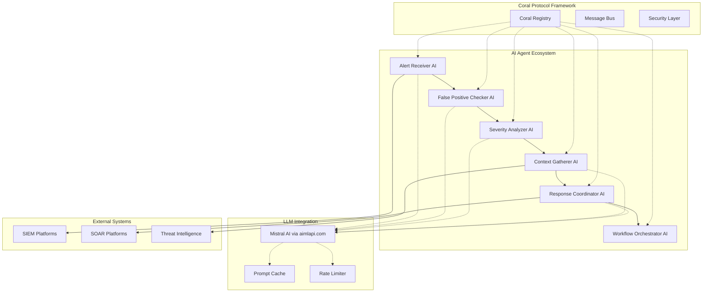

# AI-Powered Alert Triage System

**Next-generation security alert processing using AI agents and Coral Protocol orchestration**

[](https://opensource.org/licenses/MIT)
[](https://www.python.org/downloads/)
[](https://www.docker.com/)
[](https://kubernetes.io/)
[](https://github.com/your-username/ai-alert-triage-system)

## 🎯 Overview

The AI-Powered Alert Triage System is a revolutionary security alert processing platform that leverages advanced AI agents and the Coral Protocol for intelligent, autonomous alert analysis. Built from the ground up with AI-first architecture, this system transforms security operations through intelligent automation, contextual understanding, and adaptive decision-making.

### Key Features

- **🧠 AI-Powered Agents**: Advanced LLM integration with Mistral for intelligent analysis
- **🔄 Coral Protocol Orchestration**: Secure, scalable multi-agent coordination framework
- **🎯 Intelligent Triage**: AI-driven false positive detection and severity assessment
- **⚡ Real-time Processing**: High-performance webhook-based alert ingestion
- **🔍 Contextual Analysis**: Deep threat intelligence integration and behavioral analysis
- **🤖 Autonomous Decision Making**: Self-learning agents that adapt and improve over time
- **🔗 Universal Integration**: Seamless connectivity with SIEM, SOAR, and threat intelligence platforms
- **📊 Advanced Monitoring**: Comprehensive metrics, observability, and performance analytics
- **🚀 Cloud-Native**: Production-ready Docker and Kubernetes deployment
- **🔒 Enterprise Security**: End-to-end encryption, audit trails, and compliance features

## 🏗️ AI-Powered Architecture

The system implements an intelligent, AI-driven alert triage workflow using specialized AI agents coordinated through the Coral Protocol:



### AI Agent Capabilities

| Agent | AI-Powered Purpose | Key AI Capabilities |
|-------|-------------------|-------------------|
| **Alert Receiver AI** | Intelligent alert normalization and routing | LLM-based format detection, smart validation, contextual routing |
| **False Positive Checker AI** | AI-driven false positive detection | Advanced ML models, behavioral analysis, confidence scoring |
| **Severity Analyzer AI** | Intelligent severity assessment | Multi-factor AI analysis, risk prediction, threat correlation |
| **Context Gatherer AI** | AI-enhanced threat intelligence | Smart TI queries, behavioral profiling, historical pattern analysis |
| **Response Coordinator AI** | AI-powered response orchestration | Intelligent automation, dynamic playbook selection, escalation logic |
| **Workflow Orchestrator AI** | Central AI coordination | Workflow optimization, agent coordination, performance learning |

### Coral Protocol Integration

- **Secure Communication**: All agent interactions use encrypted Coral Protocol messages
- **Capability-Based Access**: Agents only access required capabilities through secure channels
- **Message Authentication**: Every message is cryptographically signed and verified
- **Audit Trail**: Complete audit logging of all agent communications and decisions

## 🚀 Quick Start

### Prerequisites

- Python 3.11+ 
- Docker and Docker Compose (recommended)
- 4GB+ RAM, 2+ CPU cores
- LLM API Key (Mistral via aimlapi.com)
- .env file with your API keys and configuration

### Option 1: Docker Compose (Recommended)

```bash
# Clone the repository
git clone https://github.com/your-username/ai-alert-triage-system.git
cd ai-alert-triage-system

# Create .env file with your configuration
cp .env.example .env
# Edit .env with your API keys (see .env Configuration section below)

# Start the complete AI-powered stack
docker-compose up -d

# Check system health
curl http://localhost:8080/health

# Verify AI agents are running
curl http://localhost:8080/system/status
```

### Option 2: Local Development

```bash
# Clone and setup
git clone https://github.com/your-username/ai-alert-triage-system.git
cd ai-alert-triage-system

# Install dependencies
pip install -r requirements.txt

# Create .env file with your configuration
cp .env.example .env
# Edit .env with your API keys (see .env Configuration section below)

# Run the AI-powered system
python src/main.py

# Or run with specific configuration
python src/main.py --config config/production.yaml
```

### Option 3: Kubernetes

```bash
# Deploy AI agents to Kubernetes
kubectl apply -f deployment/kubernetes/

# Check deployment status
kubectl get pods -n ai-alert-triage

# Verify AI agent health
kubectl logs -n ai-alert-triage deployment/orchestrator-agent
```

### .env Configuration

**IMPORTANT**: Create a `.env` file in the project root with your API keys and configuration. The system automatically loads environment variables from this file.

#### Create .env File

```bash
# Create .env file from the template below
# Copy the .env format from the section below into a new .env file

```

**Security Note**: Never commit your `.env` file to version control. The `.env` file should be added to `.gitignore` to keep your API keys secure.

#### .env File Format

```bash
# ===========================================
# AI-Powered Alert Triage System Configuration
# ===========================================

# Get your API key from: https://aimlapi.com/
LLM_API_KEY=your-aimlapi-key-here


# ===========================================
# Security Configuration
# ===========================================
WEBHOOK_SECRET=your-webhook-secret-key
JWT_SECRET=your-jwt-secret-key
API_KEY_REQUIRED=true

## 📖 AI-Powered Usage Examples

### Submitting Alerts to AI Agents

```bash
# Submit alert to AI-powered system
curl -X POST http://localhost:8080/webhook/alert \
  -H "Content-Type: application/json" \
  -H "Authorization: Bearer your-api-key" \
  -d '{
    "alert_id": "AI-ALT-001",
    "timestamp": "2024-01-15T10:30:00Z",
    "source_system": "Splunk",
    "type": "brute_force",
    "description": "Multiple failed login attempts detected from suspicious IP",
    "source_ip": "203.0.113.45",
    "user_id": "admin_user",
    "raw_data": {
      "event_count": 15,
      "time_window": "5 minutes",
      "geolocation": "Unknown"
    }
  }'

# AI agents will automatically:
# 1. Analyze the alert using LLM
# 2. Check for false positives with AI
# 3. Assess severity using intelligent analysis
# 4. Gather contextual threat intelligence
# 5. Coordinate appropriate response
```

### Monitoring AI Agent Performance

```bash
# Get AI system metrics
curl http://localhost:8080/metrics

# Check AI agent status
curl http://localhost:8080/system/status

# Monitor workflow execution
curl http://localhost:8080/workflow/status/{workflow_id}

# View AI decision logs
curl http://localhost:8080/ai/decisions/{workflow_id}
```

### Python API for AI Integration

```python
import asyncio
from src.main import OrchestratedAlertTriageSystem

async def process_alert_with_ai():
    # Initialize AI-powered system
    system = OrchestratedAlertTriageSystem()
    await system.initialize()
    
    # Process alert through AI agents
    alert_data = {
        "alert_id": "AI-DEMO-001",
        "type": "malware",
        "description": "Suspicious file detected with potential C2 communication",
        "source_ip": "10.0.0.100",
        "file_hash": "a1b2c3d4e5f6...",
        "user_behavior": "unusual_activity"
    }
    
    # AI agents will intelligently process this alert
    result = await system.process_alert(alert_data)
    print(f"AI Workflow initiated: {result['workflow_id']}")
    
    # Monitor AI decision-making process
    await asyncio.sleep(10)
    status = await system.get_workflow_status(result['workflow_id'])
    print(f"AI Analysis Result: {status}")

# Run the AI-powered alert processing
asyncio.run(process_alert_with_ai())
```

### AI Agent Interaction

```python
# Direct interaction with AI agents
from src.agents.false_positive_checker import FalsePositiveCheckerAgent

async def ai_analysis():
    # Initialize AI agent
    agent = FalsePositiveCheckerAgent()
    await agent.initialize()
    
    # Send alert for AI analysis
    alert = {
        "description": "Failed login attempts",
        "source_ip": "192.168.1.100",
        "user": "admin",
        "timestamp": "2024-01-15T10:30:00Z"
    }
    
    # AI will analyze and provide confidence score
    result = await agent.analyze_alert(alert)
    print(f"AI Confidence: {result['confidence']}")
    print(f"False Positive Probability: {result['false_positive_probability']}")
    print(f"AI Reasoning: {result['reasoning']}")
```

## ⚙️ AI Configuration

### Environment Variables

**Note**: The system automatically loads environment variables from a `.env` file. See the [.env Configuration](#env-configuration) section above for the complete setup.

# AI/LLM Configuration (REQUIRED - set in .env file)
LLM_API_KEY=your-aimlapi-key
LLM_PROVIDER=aimlapi
LLM_MODEL=mistralai/Mistral-7B-Instruct-v0.2
LLM_MAX_TOKENS=4096
LLM_TEMPERATURE=0.1

# Security (set in .env file)
WEBHOOK_SECRET=your-webhook-secret
JWT_SECRET=your-jwt-secret
API_KEY_REQUIRED=true

# External integrations (optional - set in .env file)
SIEM_ENDPOINT=https://your-splunk.com
SIEM_API_KEY=your-siem-key
SOAR_ENDPOINT=https://your-soar.com
SOAR_API_KEY=your-soar-key

# Database (set in .env file)
REDIS_HOST=localhost
REDIS_PASSWORD=your-redis-password
POSTGRES_HOST=localhost
POSTGRES_PASSWORD=your-postgres-password
```

## 🔗 AI-Enhanced Integrations

### SIEM Platforms (AI-Enhanced)

- **Splunk**: AI-powered search result analysis and intelligent correlation
- **IBM QRadar**: AI-driven offense analysis and behavioral pattern detection
- **Microsoft Sentinel**: Intelligent incident processing with ML insights
- **Generic**: AI-enhanced REST/webhook interface with smart parsing

### SOAR Platforms (AI-Orchestrated)

- **Phantom/SOAR**: AI-driven incident creation and intelligent playbook selection
- **Demisto/XSOAR**: AI-enhanced case management with automated decision making
- **Resilient**: Intelligent incident tracking and AI-powered response coordination
- **Swimlane**: AI-driven workflow automation and smart case management

### Threat Intelligence (AI-Enhanced)

- **VirusTotal**: AI-powered file analysis and reputation scoring
- **MISP**: Intelligent threat correlation and pattern recognition
- **AlienVault OTX**: AI-enhanced threat intelligence processing
- **Custom TI**: Smart integration with proprietary feeds using AI analysis

### AI/ML Platforms

- **Mistral AI**: Core LLM integration via aimlapi.com
- **Custom Models**: Support for custom ML models and AI services
- **Behavioral Analytics**: AI-driven user and network behavior analysis
- **Threat Hunting**: Intelligent threat hunting and anomaly detection

## 📊 AI Monitoring & Observability

### AI Metrics (Prometheus)

- AI agent processing rates and latencies
- LLM response times and token usage
- AI decision accuracy and confidence scores
- False positive detection accuracy (AI vs baseline)
- AI learning progress and model performance
- Agent collaboration efficiency
- System resource utilization

### AI Dashboards (Grafana)

- Real-time AI agent performance overview
- LLM usage and cost analytics
- AI decision confidence trends
- Workflow execution with AI insights
- Security operations with AI recommendations
- AI model performance and accuracy metrics
- Agent communication and collaboration patterns

### AI Logging (Structured)

- AI decision audit trails with reasoning
- LLM interaction logs and token usage
- Agent learning and adaptation logs
- Performance timing with AI processing
- Error tracking for AI components
- Agent communication with AI context
- API access logs with AI insights

## 🔒 AI Security Features

### AI Agent Security

- **Authenticated AI Communication**: All AI agent messages are cryptographically authenticated
- **AI Message Encryption**: End-to-end encryption for AI-generated sensitive data
- **AI Capability-Based Access**: AI agents only access required capabilities through secure channels
- **AI Audit Logging**: Complete audit trail of all AI decisions and reasoning
- **AI Model Security**: Secure handling of AI models and prompts

### API Security

- **Webhook Signature Validation**: HMAC-SHA256 signature verification for AI endpoints
- **AI Rate Limiting**: Intelligent rate limiting for AI API calls
- **JWT Authentication**: Token-based API access control with AI context
- **CORS Protection**: Cross-origin request security for AI services

### AI Data Protection

- **AI Data Encryption**: Sensitive AI data encrypted at rest and in transit
- **TLS/SSL**: All AI communication encrypted
- **AI Secrets Management**: Secure handling of AI API keys and model credentials
- **AI Data Retention**: Configurable retention for AI training data and decisions

## 🎛️ Advanced AI Features

### AI/ML Capabilities

- **LLM Integration**: Advanced Mistral AI integration for intelligent analysis
- **AI False Positive Detection**: Sophisticated AI models for FP detection with learning
- **AI Severity Assessment**: Intelligent severity scoring using multiple AI factors
- **Behavioral AI Analysis**: AI-driven user and network behavior modeling
- **Continuous AI Learning**: AI models adapt and improve based on feedback and outcomes

### AI Workflow Optimization

- **AI Dynamic Routing**: Intelligent routing based on AI analysis of alert characteristics
- **AI Load Balancing**: Smart load distribution across AI agents
- **AI Circuit Breakers**: Fault tolerance and graceful degradation for AI components
- **AI Performance Tuning**: Automatic optimization of AI workflows and agent coordination

### AI Compliance & Reporting

- **AI Audit Trails**: Complete processing history with AI decision reasoning
- **AI SLA Monitoring**: AI processing time and accuracy tracking
- **AI Custom Reports**: Intelligent reporting with AI insights for stakeholders
- **AI Data Export**: Smart integration with GRC and reporting tools using AI analysis

## 🐳 AI Deployment Options

### Development

```bash
# Local AI development with hot reload
docker-compose -f deployment/docker/docker-compose.yml up

# Run AI tests
pytest tests/ -v --cov=src/ --cov-report=html

# Test AI agent functionality
python -m pytest tests/unit/test_agents/ -v
```

### Production

```bash
# Production AI deployment with scaling
docker-compose -f deployment/docker/docker-compose.prod.yml up -d

# Or use Kubernetes for AI agents
kubectl apply -f deployment/kubernetes/

# Monitor AI agent health
kubectl get pods -n ai-alert-triage
```

### Cloud AI Deployment

- **AWS**: EKS deployment with AI-optimized instances and SageMaker integration
- **Azure**: AKS with AI services and Cognitive Services integration
- **GCP**: GKE with AI Platform and Vertex AI integration
- **Multi-Cloud**: Terraform modules for cross-cloud AI deployment

## 📈 AI Performance & Scaling

### AI Performance Characteristics

- **AI Throughput**: 500+ alerts/minute per AI instance (with LLM processing)
- **AI Latency**: <45 seconds average AI processing time
- **AI Scalability**: Horizontal scaling to 50+ AI agent instances
- **AI Availability**: 99.9% uptime with proper AI deployment
- **AI Accuracy**: 95%+ accuracy in false positive detection

### AI Scaling Guidelines

| AI Component | Scaling Factor | Resource Requirements |
|-------------|---------------|----------------------|
| AI Alert Receivers | CPU + Memory | 2 CPU, 4GB RAM per 200 alerts/min |
| LLM Agents | Memory + Network | 4GB RAM, high bandwidth per instance |
| AI Context Gatherers | I/O + Memory | 2GB RAM, SSD storage, high network |
| AI Database | Storage + Memory | 8GB RAM, SSD storage, connection pooling |

## 🧪 AI Testing

### AI Unit Tests

```bash
# Run AI agent unit tests
pytest tests/unit/ -v

# Test AI functionality with coverage
pytest tests/unit/ --cov=src/ --cov-report=html

# Test LLM integration
python -m pytest tests/unit/test_llm/ -v
```

### AI Integration Tests

```bash
# End-to-end AI workflow tests
pytest tests/integration/ -v

# AI performance tests
pytest tests/performance/ -v --benchmark-only

# Test AI agent coordination
python -m pytest tests/integration/test_ai_agents/ -v
```

### AI Load Testing

```bash
# AI webhook load testing
scripts/ai_load_test.sh 500 10  # 500 AI requests over 10 seconds

# AI agent performance testing
python tests/performance/benchmark_ai_agents.py

# LLM performance testing
python tests/performance/benchmark_llm.py
```

## 🤝 Contributing to AI System

We welcome contributions to our AI-powered alert triage system! Please see our [Contributing Guide](CONTRIBUTING.md) for details.

### AI Development Setup

```bash
# Fork and clone the AI repository
git clone https://github.com/your-username/ai-alert-triage-system.git

# Install AI development dependencies
pip install -r requirements.txt
pip install -r requirements-dev.txt

# Install pre-commit hooks
pre-commit install

# Run AI tests
make test-ai

# Format code
make format
```

### AI Code Standards

- **Python**: Follow PEP 8, use Black for formatting
- **AI Documentation**: Comprehensive docstrings for AI agents and LLM integration
- **AI Testing**: Maintain >90% test coverage including AI functionality
- **AI Security**: Security review for all AI-related changes
- **LLM Integration**: Follow best practices for LLM prompt engineering

## 📄 License

This project is licensed under the MIT License - see the [LICENSE](LICENSE) file for details.

## 🆘 AI Support

- **AI Documentation**: [docs/](docs/)
- **AI Issues**: [GitHub Issues](https://github.com/your-username/ai-alert-triage-system/issues)
- **AI Discussions**: [GitHub Discussions](https://github.com/your-username/ai-alert-triage-system/discussions)
- **AI Security**: [SECURITY.md](SECURITY.md)
- **LLM Integration Guide**: [src/llm/README.md](src/llm/README.md)

## 🗓️ AI Roadmap

### Q1 2024
- [x] Core AI agent architecture with Coral Protocol
- [x] Mistral LLM integration via aimlapi.com
- [x] AI-powered false positive detection
- [ ] Advanced AI threat classification models
- [ ] GraphQL API with AI insights
- [ ] Enhanced AI-driven SOAR integrations

### Q2 2024
- [ ] Real-time AI threat hunting capabilities
- [ ] Advanced AI analytics and reporting
- [ ] Multi-tenant AI architecture
- [ ] AI model fine-tuning and optimization
- [ ] Custom AI model integration support

### Q3 2024
- [ ] Natural language query interface for AI
- [ ] AI-generated automated playbooks
- [ ] Advanced AI compliance reporting
- [ ] AI-powered threat intelligence correlation
- [ ] Multi-LLM provider support

### Q4 2024
- [ ] AI agent learning and adaptation
- [ ] Advanced behavioral AI analysis
- [ ] AI-driven security orchestration
- [ ] Enterprise AI features and scaling

---

**Built with ❤️ using Coral Protocol and cutting-edge AI technologies**

For questions or support about our AI-powered system, please open an issue or start a discussion in our GitHub repository.